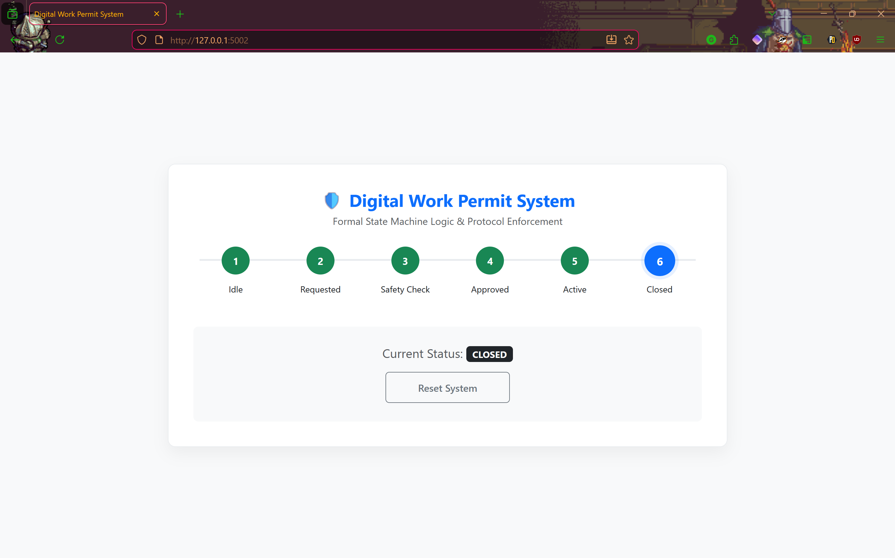

# 🛡️ Digital Work Permit System (Formal State Machine)


**A deterministic state-machine system for enforcing safety protocol compliance.**

This project models the "Permit-to-Work" (PTW) process as a **Finite State Machine (FSM)**. Unlike standard databases, this system uses formal transition rules to ensure that a permit cannot reach an `ACTIVE` state without passing through mandatory `SAFETY_CHECK` and `APPROVAL` states. This prevents "process skipping," a common cause of industrial accidents.

---

## 📸 State Transition Visualization

*(Figure 1: Visual tracking of the permit lifecycle. Transitions are strictly enforced by the backend logic.)*

---

## 🚀 Key Features

* **Deterministic Logic:**
    * Implements a strict FSM using the `transitions` library.
    * Invalid transitions (e.g., jumping from `Idle` to `Active`) raise immediate `FormalViolation` errors.
* **Process Enforcement:**
    * **Safety Check Constraint:** Work cannot begin until the safety verification state is successfully resolved.
    * **Auditability:** Every state change is tracked and validated against the logic model.

---

## 🛠️ Technical Implementation

| Component | Technology | Purpose |
| :--- | :--- | :--- |
| **Logic Engine** | Python `transitions` | Formal State Machine implementation |
| **Backend** | Flask | Web Interface & API |
| **Frontend** | Bootstrap 5 | Visual State Diagram |

---

## ⚡ How to Run

### 1. Setup Environment
```bash
python -m venv venv
.\venv\Scripts\activate
pip install -r requirements.txt