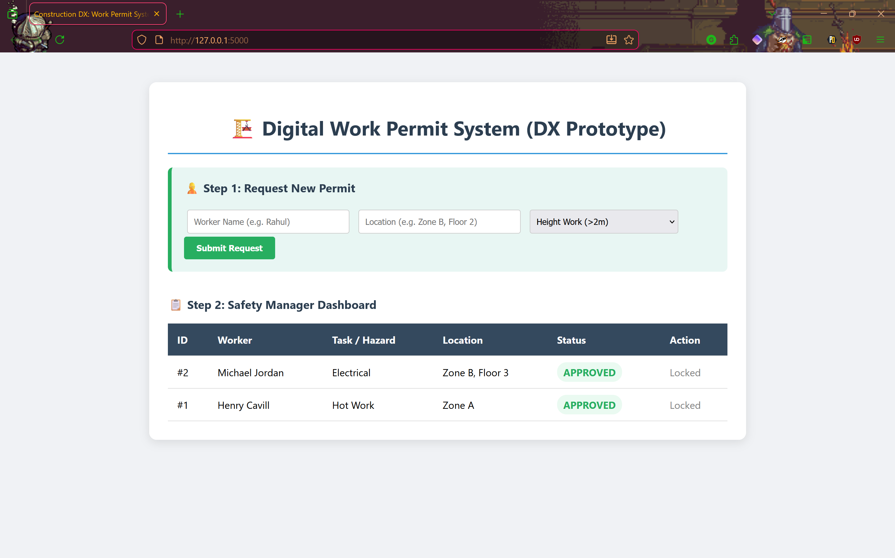

# 🏗️ Digital Work Permit System (Construction DX)

### Overview
A Python-based prototype designed to digitize the manual "Permit to Work" (PTW) process on construction sites. This tool replaces paper forms with a real-time digital dashboard, improving site safety compliance.

### Why I Built This
As a holder of an **Advanced Diploma in Industrial Safety** and a **Work Permit Receiver** certificate, I noticed that paper permits are slow and hard to track. This tool solves that problem using Python.

### Features
* **Role-Based Workflow:** Workers submit requests; Safety Managers approve/reject.
* **Real-time Tracking:** Dashboard shows active high-risk activities (Hot Work, Height Work).
* **Tech Stack:** Python (Flask), HTML5/CSS3, SQLite.

### Screenshot

